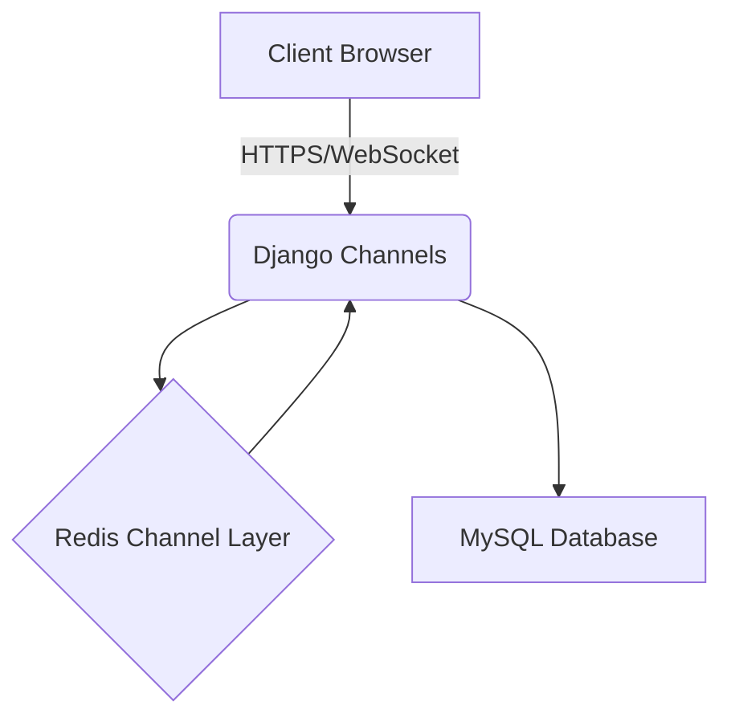

# Threat Model

This document outlines potential threats to the WebSocket chat application using the STRIDE framework and presents a data flow diagram of the WebSocket messaging path.

## STRIDE Analysis

| Category | Example | Mitigation |
|----------|---------|------------|
| **Spoofing** | Attacker impersonates another user by stealing session cookies | Use HTTPS and secure cookies; verify authentication on every WebSocket message |
| **Tampering** | Malicious client sends altered messages | Validate and sanitize all input; store message hashes in AuditLog |
| **Repudiation** | User denies sending a message | Maintain immutable audit logs with timestamps and user IDs |
| **Information Disclosure** | Eavesdropper intercepts WebSocket traffic | Enforce TLS for all connections and encrypt messages when possible |
| **Denial of Service** | Flooding the server with connections or messages | Apply rate limiting in the consumer and restrict idle connections |
| **Elevation of Privilege** | Standard user gains admin capabilities | Enforce role-based checks in API views and WebSocket handlers |

## WebSocket Data Flow

